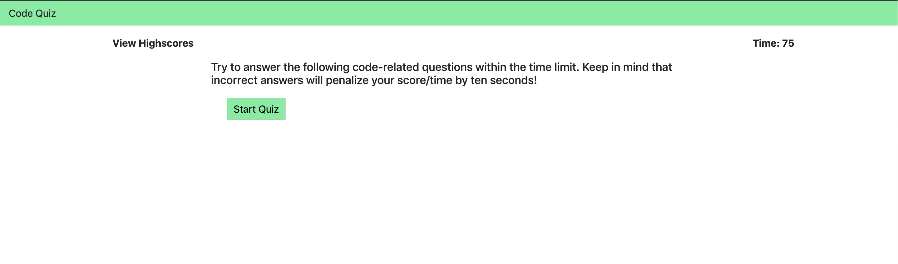

# Code Quiz

## Purpose
As I proceed in my career as a web developer, I will probably be asked to complete a coding assessment. These assessments are typically a combination of multiple-choice questions and interactive challenges. In this homework assignment, my challenge was to build a code quiz with multiple-choice questions.

## Description
This application is timer-based quiz that stores high scores client-side. It is responsive.

The user arrives at the landing page and is presented with a call-to-action to "Start Quiz." Also note the navigation option to "View Highscores" and the "Time" value set at 75.

Clicking the "Start Quiz" button presents the user with a series of questions. The timer is initialized with a value and immediately begins countdown.

Score is calculated by time remaining. Answering quickly and correctly results in a higher score. Answering incorrectly results in a time penalty (for example, 15 seconds are subtracted from time remaining).

When time runs out and/or all questions are answered, the user is presented with their final score and asked to enter their initials. Their final score and initials are then stored in localStorage.

## Images

## Links

https://drewhowell.github.io/codequiz/

